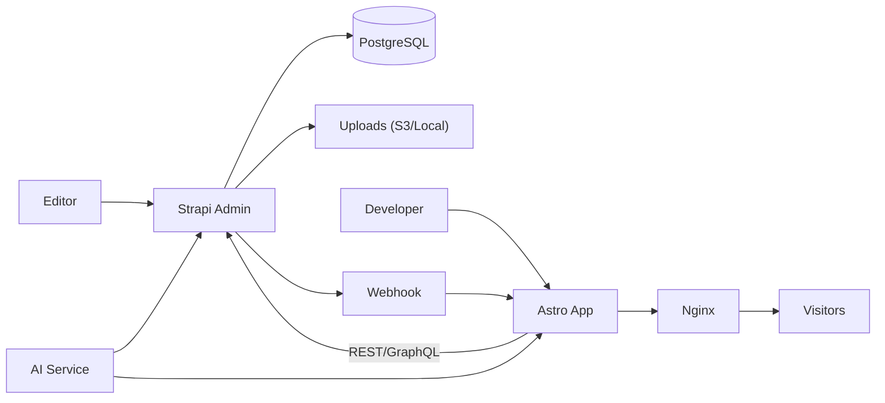

# Отчёт: целевая архитектура `Strapi 5 + Astro` для AI-управляемого сайта

Актуальность: 2026-02-12
Приоритет: **AI + удобство редакторов + современный стек**

## 1. Executive Summary

Рекомендуемая целевая платформа:

- **CMS:** `Strapi 5` (контент-модели, роли, workflow, API)
- **Frontend:** `Astro` (SSR/SSG, быстрый HTML, SEO)
- **БД:** `PostgreSQL 16`
- **Deploy:** `Docker Compose` на `VDS` (Ubuntu 24.04 LTS)
- **Reverse proxy:** `Nginx` + `Let's Encrypt`
- **AI-контур:** отдельный сервис/модуль генерации контента через LLM API

Почему это решение:

- редакторы получают зрелую CMS с удобным UI и публикацией;
- разработчики получают современный DX (TypeScript, API-first, компонентный рендер);
- AI можно встроить в процесс контента без привязки к одной модели;
- локальная разработка на macOS практически идентична прод-контуру на VDS.

## 2. Архитектура системы



## 3. Компоненты и зоны ответственности

### 3.1 Strapi (backend CMS)

- управление моделями контента (например: `Page`, `Section`, `FAQ`, `SEO`, `Menu`);
- Draft/Publish, роли и права (`Editor`, `Reviewer`, `Admin`);
- выдача контента через REST/GraphQL для Astro;
- Webhook после публикации (revalidate или rebuild frontend);
- AI-кнопки в админке: генерация черновиков, переписывание, summary, translation.

### 3.2 Astro (frontend)

- рендеринг сайта (SSR или SSG + ISR/revalidate);
- слой UI-компонентов и интеграция Carrd-стилей/плагинов;
- оптимизация скорости (частичная гидратация, image pipeline, cache headers);
- Preview-режим для редактора с просмотром черновиков до публикации.

### 3.3 AI Service (опционально отдельно)

- унифицированный адаптер к LLM (внешний API или self-hosted модель);
- шаблоны промптов по типам контента;
- post-processing: валидация длины, tone-of-voice, запрещённые слова, SEO-поля;
- журналирование запросов AI для аудита.

### 3.4 Infrastructure

- `PostgreSQL` как единственный источник контента;
- хранилище медиа: локальный volume или S3-совместимое;
- `Nginx` как TLS terminator и reverse proxy;
- регулярные бэкапы БД и uploads.

## 4. Целевые пользовательские пути

### 4.1 Путь разработчика (Developer Journey)

1. Поднимает проект локально на macOS (`Strapi + Astro + Postgres`).
2. Создаёт/обновляет content types в Strapi.
3. Связывает API со страницами Astro.
4. Проверяет Preview и публикацию.
5. Делает PR, проходит CI, выкатывает на VDS.

Ключевой результат: новый функционал проходит путь от модели данных до рендера сайта без ручных операций на сервере.

### 4.2 Путь редактора (Editor Journey)

1. Входит в Strapi Admin.
2. Создаёт материал (например, новый лендинг-блок или FAQ).
3. Нажимает `Generate with AI` для черновика.
4. Редактирует, проверяет превью.
5. Публикует запись.
6. Изменения автоматически появляются на сайте (через webhook/revalidate).

Ключевой результат: редактор управляет контентом без кода и без участия разработчика.

### 4.3 Путь DevOps/владельца платформы

1. Управляет секретами и доменами.
2. Контролирует бэкапы и мониторинг.
3. Выполняет обновления контейнеров.
4. Проводит rollback в случае инцидента.

Ключевой результат: эксплуатация предсказуема, восстановление занимает минуты, а не часы.

## 5. Разработка на macOS (локальная установка)

### 5.1 Базовые требования

- `Node.js` LTS (рекомендован `22.x` для совместимости Strapi 5 и Astro);
- `pnpm` или `npm`;
- `Docker Desktop` (для Postgres и инфраструктуры);
- `Git`.

### 5.2 Проверка окружения

```bash
node -v
npm -v
docker --version
docker compose version
```

### 5.3 Рекомендуемая структура репозитория

```text
platform/
  apps/
    cms/           # Strapi
    web/           # Astro
  infra/
    compose/
      docker-compose.dev.yml
      docker-compose.prod.yml
  .env.example
```

### 5.4 Запуск PostgreSQL для dev

```bash
mkdir -p infra/compose
cat > infra/compose/docker-compose.dev.yml <<'YAML'
services:
  postgres:
    image: postgres:16
    environment:
      POSTGRES_DB: cms
      POSTGRES_USER: cms
      POSTGRES_PASSWORD: cms
    ports:
      - "5432:5432"
    volumes:
      - pgdata_dev:/var/lib/postgresql/data
volumes:
  pgdata_dev:
YAML

docker compose -f infra/compose/docker-compose.dev.yml up -d
```

### 5.5 Инициализация Strapi 5

```bash
npx create-strapi@latest apps/cms
```

На этапе setup выбрать:

- TypeScript: `Yes`
- Database: `PostgreSQL`
- Host/Port: `0.0.0.0:1337` (для Docker/локальной сети)

Минимальные env для `apps/cms/.env`:

```bash
HOST=0.0.0.0
PORT=1337
DATABASE_CLIENT=postgres
DATABASE_HOST=127.0.0.1
DATABASE_PORT=5432
DATABASE_NAME=cms
DATABASE_USERNAME=cms
DATABASE_PASSWORD=cms
JWT_SECRET=change_me
ADMIN_JWT_SECRET=change_me
APP_KEYS=change_me_1,change_me_2,change_me_3,change_me_4
API_TOKEN_SALT=change_me
```

Запуск:

```bash
cd apps/cms
npm run develop
```

### 5.6 Инициализация Astro

```bash
npm create astro@latest apps/web
cd apps/web
npm install
npm install @astrojs/node
```

Базовый запуск:

```bash
npm run dev
```

### 5.7 Интеграция Astro ↔ Strapi

Минимальные env в `apps/web/.env`:

```bash
STRAPI_URL=http://localhost:1337
STRAPI_TOKEN=replace_with_api_token
```

Принцип интеграции:

- Astro получает опубликованный контент из Strapi;
- в Preview-режиме Astro читает черновики по отдельному токену/маршруту;
- публикация в Strapi вызывает webhook на Astro endpoint для revalidate.

## 6. Размещение на VDS (production)

### 6.1 Минимальная конфигурация VDS

- CPU: 2 vCPU
- RAM: 4 GB (минимум 2 GB для небольших проектов)
- Disk: 40+ GB SSD
- OS: Ubuntu 24.04 LTS

### 6.2 Базовая подготовка сервера

```bash
sudo apt update && sudo apt upgrade -y
sudo apt install -y ca-certificates curl gnupg git ufw
```

Установка Docker:

```bash
curl -fsSL https://get.docker.com | sh
sudo usermod -aG docker $USER
```

### 6.3 Директории на сервере

```bash
sudo mkdir -p /opt/platform
sudo chown -R $USER:$USER /opt/platform
```

Рекомендуемые подкаталоги:

```text
/opt/platform/
  apps/
  infra/
  storage/
    postgres/
    uploads/
  backups/
```

### 6.4 Production `docker-compose`

Сервисы:

- `postgres` (volume в `/opt/platform/storage/postgres`)
- `strapi` (порт внутренний `1337`)
- `astro` (порт внутренний `4321`)
- `nginx` (публичные `80/443`)

Сетевой маршрут:

- `site.ru` -> `nginx` -> `astro:4321`
- `api.site.ru` -> `nginx` -> `strapi:1337`

### 6.5 Деплой-пайплайн

1. `git push main` в репозиторий.
2. CI собирает Docker-образы `cms` и `web`.
3. CI публикует образы в registry.
4. На VDS выполняется `docker compose pull && docker compose up -d`.
5. Health check подтверждает доступность `site.ru` и `api.site.ru`.

## 7. AI-поток в редакторском процессе

### 7.1 Что автоматизируется

- генерация первого черновика страницы;
- rewrite под tone-of-voice бренда;
- генерация SEO title/description;
- извлечение FAQ из длинного текста;
- перевод RU/EN.

### 7.2 Правила для качества AI

- каждый content type имеет свой prompt-template;
- результат AI не публикуется автоматически (только Draft);
- обязательна ручная валидация редактором;
- сохраняется история изменений.

## 8. Безопасность и отказоустойчивость

### 8.1 Безопасность

- закрыть прямой доступ к `1337/4321` извне (только Nginx);
- использовать отдельные API токены для Preview и Public;
- включить rate limiting на публичных API;
- регулярная ротация `JWT_SECRET`, `APP_KEYS`, API tokens;
- минимум прав в ролях редакторов.

### 8.2 Бэкапы

- ежедневный `pg_dump` в `/opt/platform/backups/postgres`;
- архив uploads;
- хранение минимум 7 ежедневных + 4 недельных копий;
- регулярный restore-test (не реже 1 раза в месяц).

### 8.3 Наблюдаемость

- базовые метрики: CPU/RAM/Disk, время ответа API, 5xx;
- алерты в Telegram/Slack;
- отдельный лог ошибок Strapi и Astro.

## 9. План внедрения

### 9.1 Фаза 1 (1-2 недели)

- развёртывание dev-платформы;
- создание ключевых content types;
- интеграция 2-3 страниц в Astro;
- запуск preview + publish webhook.

### 9.2 Фаза 2 (1-2 недели)

- миграция контента из текущей CMS;
- настройка ролей редакторов;
- запуск AI-функций в Draft-потоке;
- hardening production (backup, monitoring, firewall).

### 9.3 Фаза 3 (непрерывно)

- оптимизация производительности;
- расширение AI-шаблонов;
- A/B эксперименты контентных блоков.

## 10. Критерии успеха

- редактор публикует новую страницу без разработчика;
- среднее время публикации снижается минимум в 2 раза;
- page speed держится в зелёной зоне для мобильных;
- rollback на предыдущий релиз занимает менее 15 минут.

## 11. Риски и как их снять

- Риск: сложные модели контента тормозят запуск.
  Решение: начать с 5-7 базовых content types и расширять по мере роста.

- Риск: AI генерирует неточный текст.
  Решение: AI только в Draft + шаблоны промптов + обязательная редактура.

- Риск: единичная точка отказа VDS.
  Решение: автоматические бэкапы + документированный recovery runbook.

## 12. Проверочный чек-лист запуска

- [ ] Strapi Admin доступен по защищённому домену.
- [ ] Astro отдаёт production-страницы через Nginx.
- [ ] Preview работает для черновиков.
- [ ] Publish webhook обновляет контент без ручного деплоя.
- [ ] Бэкапы БД и uploads включены и проверены restore.
- [ ] AI-кнопки создают только Draft, не Public.

## 13. Источники (официальная документация)

- Strapi docs: https://docs.strapi.io/cms/quick-start
- Strapi deployment: https://docs.strapi.io/cms/deployment
- Astro install/setup: https://docs.astro.build/en/install-and-setup/
- Astro deploy guide: https://docs.astro.build/en/guides/deploy/
